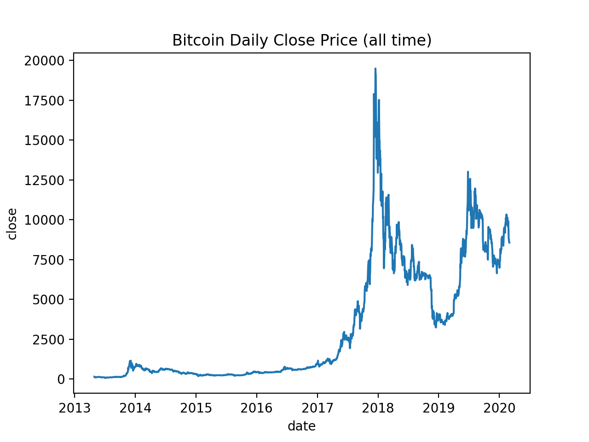
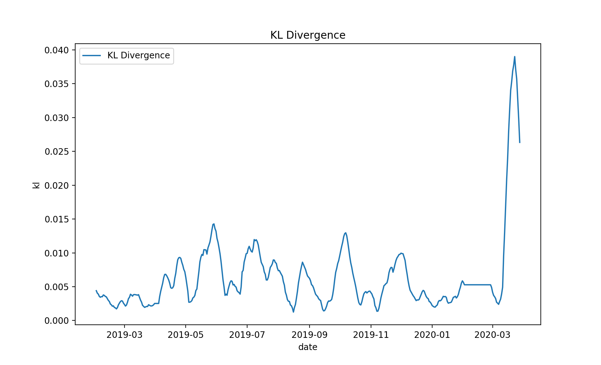
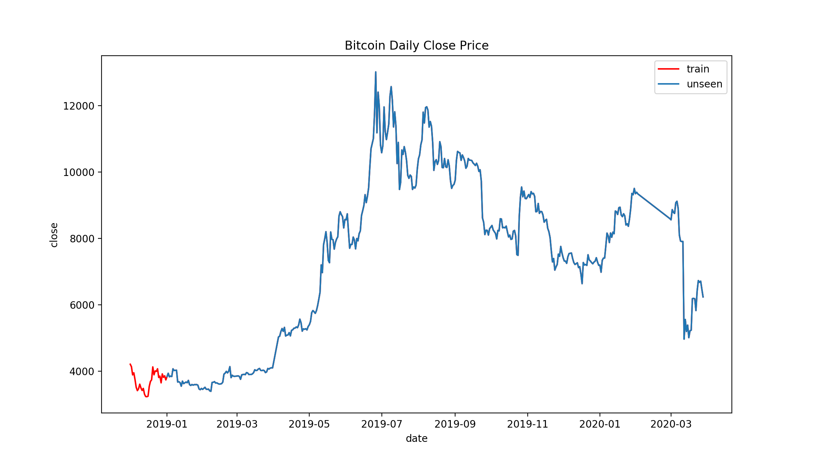
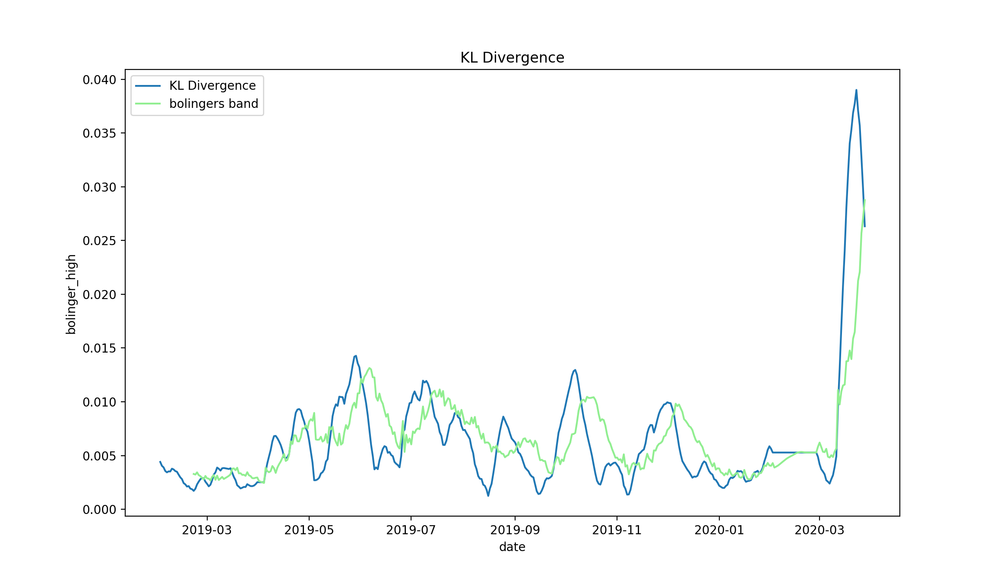

# Change Point Detection - KL Divergence


When we build a machine learning model, we validate and test its accuracies/performance in various ways. Although the accuracy is quite high in the test set, the prediction will eventually drift by time. This is often caused by the future data "drift" to a different state from the training dataset. But how can we detect this drift effectively? This blogpost shows using direct ratio estimation to detect the change point with Bitcoin daily price data. This project is documented in my [medium blog]() and Bitcoin price data are from [CoinMarketCap](https://coinmarketcap.com/currencies/bitcoin/historical-data/?start=20130429&end=20200302)

## Table of contents
- [Requirements](#requirements)
- [Data](#data)
- [KL Divergence to detect the state change](#kl-divergence-to-detect-the-state-change)
- [Conclusion and Next Steps](#conclusion-and-next-steps)

## Requirements
```
matplotlib == 3.1.2
numpy == 1.18.1
pandas == 0.23.4
scipy == 1.4.1
seaborn == 0.9.0
```

## Data
It includes dates, open, high, low, close prices, volumes and market caps of the date (all the prices are in USD) from 2013–04–29 until 2020–03–28.

Here is the historical day to day price plot of Bitcoin.



## KL Divergence to detect the state change

we will use a fixed window in the train set. So that we can calculate how (not) train set and unseen data are similar.

Here suppose we built a machine learning model that can predict the Bitcoin close price of the next day by using its data from 2013–04–29 until the end of 2018. So we will compare some subsequence from the train set and unseen future prices. Here we will try to see the model drift on a monthly level, thus set the window as 30.

```
from scipy.stats import entropy
from datetime import date, timedelta

start_date = date(2019,2,1)
end_date = date(2020,3,28)
delta = timedelta(days=1)

kl = []
date = []

while start_date <= end_date:
    kld = entropy(np.array(df[df['date'] < 
                  '2019-01-01'].close.tail(30)), 
                   np.array(df[df['date'] <= 
                   start_date].close.tail(30)))
    kl += [kld]
    date += [start_date]
    start_date+=delta

kl = pd.DataFrame(list(zip(date,kl)), columns=['date','kl'])
```

Here is the plot of the estimated KL Divergence and Bitcoin price in 2019.





Comparing to the actual price changes, we notice that when the price sores a lot in a short time of period, the estimated value also spikes. It is interesting that even though the Bitcoin price is an upward trend since the beginning of 2019 until it hit its highest value around July 2019 and then became downtrend, the estimated KL divergence values show 'constant waves' until 2020. It might be because the distribution of the train set already takes into the volatility of Bitcoin price and the theoretical constant inflation account so that the estimated KL divergence values are not really responding to a gradual increase of the price but rather abrupt price change.

Also we can apply Bolinger Bands to have a threshold for the decision making. 



## Conclusion and Next Steps

* CPD aims to detect the dissimilarity of two subsequences in the time-series probability distributions.
* As both of KL divergence and RuLSIF are not normalised ratios and don't have a clear threshold to determine the "state change". So it is important to determine an appropriate rule to detect the change.
* The length of the window is also one of the key points for this method. When you set the window small, it is more sensitive to changes. It can detect even small change quickly however this also can capture false-positive cases - like just a temporal drift of the variables. On the other hand, when you set a bigger window, its estimation would be more stable and get less false-positive cases. Yet it would take some period of time to actually detect the state change.
* We don't know what caused the state change by merely checking the target variable and often our interest is what caused the change. One of the solutions for this is monitoring all the features in the model so that we can actually see which part of the model is changing.